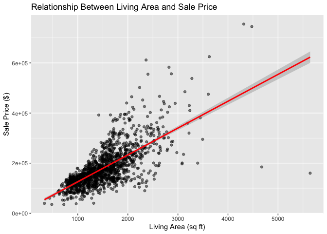
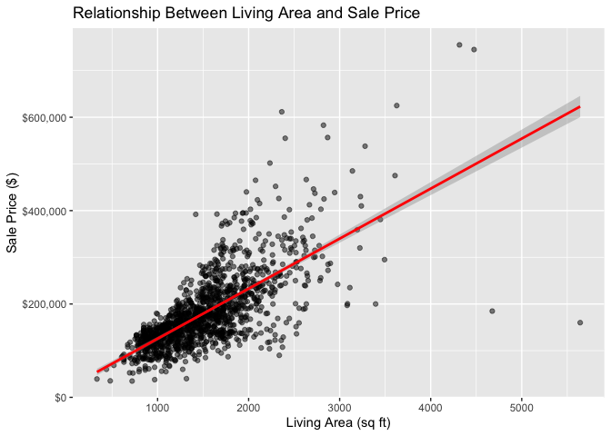
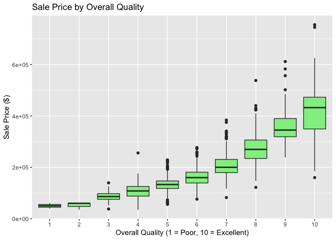
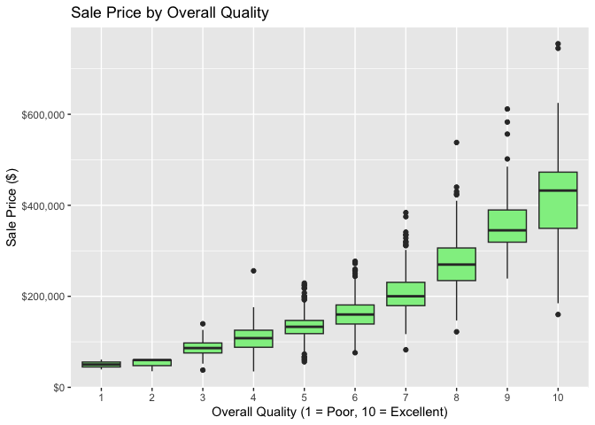

Final Project Report
================
Nhu Phan
2025-11-20

## Introduction

Housing prices are influenced by a multitude of factors, including the
size of the property, its age, quality of construction, and location.
Understanding these relationships is important not only for prospective
buyers and sellers but also for urban planners, real estate investors,
and economists.

This project uses the Ames Housing Dataset from Kaggle, which contains
detailed information on over 1,400 homes in Ames, Iowa, to analyze which
features most strongly affect house prices. By systematically exploring
variables like living area, neighborhood, overall quality, and garage
size, the goal is to determine the key drivers of housing prices and to
understand patterns that may inform decision-making in real estate
markets.

## Data

``` r
ames <- read_csv("train.csv")
```

    ## Rows: 1460 Columns: 81
    ## ── Column specification ────────────────────────────────────────────────────────
    ## Delimiter: ","
    ## chr (43): MSZoning, Street, Alley, LotShape, LandContour, Utilities, LotConf...
    ## dbl (38): Id, MSSubClass, LotFrontage, LotArea, OverallQual, OverallCond, Ye...
    ## 
    ## ℹ Use `spec()` to retrieve the full column specification for this data.
    ## ℹ Specify the column types or set `show_col_types = FALSE` to quiet this message.

``` r
glimpse(ames)
```

    ## Rows: 1,460
    ## Columns: 81
    ## $ Id            <dbl> 1, 2, 3, 4, 5, 6, 7, 8, 9, 10, 11, 12, 13, 14, 15, 16, 1…
    ## $ MSSubClass    <dbl> 60, 20, 60, 70, 60, 50, 20, 60, 50, 190, 20, 60, 20, 20,…
    ## $ MSZoning      <chr> "RL", "RL", "RL", "RL", "RL", "RL", "RL", "RL", "RM", "R…
    ## $ LotFrontage   <dbl> 65, 80, 68, 60, 84, 85, 75, NA, 51, 50, 70, 85, NA, 91, …
    ## $ LotArea       <dbl> 8450, 9600, 11250, 9550, 14260, 14115, 10084, 10382, 612…
    ## $ Street        <chr> "Pave", "Pave", "Pave", "Pave", "Pave", "Pave", "Pave", …
    ## $ Alley         <chr> NA, NA, NA, NA, NA, NA, NA, NA, NA, NA, NA, NA, NA, NA, …
    ## $ LotShape      <chr> "Reg", "Reg", "IR1", "IR1", "IR1", "IR1", "Reg", "IR1", …
    ## $ LandContour   <chr> "Lvl", "Lvl", "Lvl", "Lvl", "Lvl", "Lvl", "Lvl", "Lvl", …
    ## $ Utilities     <chr> "AllPub", "AllPub", "AllPub", "AllPub", "AllPub", "AllPu…
    ## $ LotConfig     <chr> "Inside", "FR2", "Inside", "Corner", "FR2", "Inside", "I…
    ## $ LandSlope     <chr> "Gtl", "Gtl", "Gtl", "Gtl", "Gtl", "Gtl", "Gtl", "Gtl", …
    ## $ Neighborhood  <chr> "CollgCr", "Veenker", "CollgCr", "Crawfor", "NoRidge", "…
    ## $ Condition1    <chr> "Norm", "Feedr", "Norm", "Norm", "Norm", "Norm", "Norm",…
    ## $ Condition2    <chr> "Norm", "Norm", "Norm", "Norm", "Norm", "Norm", "Norm", …
    ## $ BldgType      <chr> "1Fam", "1Fam", "1Fam", "1Fam", "1Fam", "1Fam", "1Fam", …
    ## $ HouseStyle    <chr> "2Story", "1Story", "2Story", "2Story", "2Story", "1.5Fi…
    ## $ OverallQual   <dbl> 7, 6, 7, 7, 8, 5, 8, 7, 7, 5, 5, 9, 5, 7, 6, 7, 6, 4, 5,…
    ## $ OverallCond   <dbl> 5, 8, 5, 5, 5, 5, 5, 6, 5, 6, 5, 5, 6, 5, 5, 8, 7, 5, 5,…
    ## $ YearBuilt     <dbl> 2003, 1976, 2001, 1915, 2000, 1993, 2004, 1973, 1931, 19…
    ## $ YearRemodAdd  <dbl> 2003, 1976, 2002, 1970, 2000, 1995, 2005, 1973, 1950, 19…
    ## $ RoofStyle     <chr> "Gable", "Gable", "Gable", "Gable", "Gable", "Gable", "G…
    ## $ RoofMatl      <chr> "CompShg", "CompShg", "CompShg", "CompShg", "CompShg", "…
    ## $ Exterior1st   <chr> "VinylSd", "MetalSd", "VinylSd", "Wd Sdng", "VinylSd", "…
    ## $ Exterior2nd   <chr> "VinylSd", "MetalSd", "VinylSd", "Wd Shng", "VinylSd", "…
    ## $ MasVnrType    <chr> "BrkFace", "None", "BrkFace", "None", "BrkFace", "None",…
    ## $ MasVnrArea    <dbl> 196, 0, 162, 0, 350, 0, 186, 240, 0, 0, 0, 286, 0, 306, …
    ## $ ExterQual     <chr> "Gd", "TA", "Gd", "TA", "Gd", "TA", "Gd", "TA", "TA", "T…
    ## $ ExterCond     <chr> "TA", "TA", "TA", "TA", "TA", "TA", "TA", "TA", "TA", "T…
    ## $ Foundation    <chr> "PConc", "CBlock", "PConc", "BrkTil", "PConc", "Wood", "…
    ## $ BsmtQual      <chr> "Gd", "Gd", "Gd", "TA", "Gd", "Gd", "Ex", "Gd", "TA", "T…
    ## $ BsmtCond      <chr> "TA", "TA", "TA", "Gd", "TA", "TA", "TA", "TA", "TA", "T…
    ## $ BsmtExposure  <chr> "No", "Gd", "Mn", "No", "Av", "No", "Av", "Mn", "No", "N…
    ## $ BsmtFinType1  <chr> "GLQ", "ALQ", "GLQ", "ALQ", "GLQ", "GLQ", "GLQ", "ALQ", …
    ## $ BsmtFinSF1    <dbl> 706, 978, 486, 216, 655, 732, 1369, 859, 0, 851, 906, 99…
    ## $ BsmtFinType2  <chr> "Unf", "Unf", "Unf", "Unf", "Unf", "Unf", "Unf", "BLQ", …
    ## $ BsmtFinSF2    <dbl> 0, 0, 0, 0, 0, 0, 0, 32, 0, 0, 0, 0, 0, 0, 0, 0, 0, 0, 0…
    ## $ BsmtUnfSF     <dbl> 150, 284, 434, 540, 490, 64, 317, 216, 952, 140, 134, 17…
    ## $ TotalBsmtSF   <dbl> 856, 1262, 920, 756, 1145, 796, 1686, 1107, 952, 991, 10…
    ## $ Heating       <chr> "GasA", "GasA", "GasA", "GasA", "GasA", "GasA", "GasA", …
    ## $ HeatingQC     <chr> "Ex", "Ex", "Ex", "Gd", "Ex", "Ex", "Ex", "Ex", "Gd", "E…
    ## $ CentralAir    <chr> "Y", "Y", "Y", "Y", "Y", "Y", "Y", "Y", "Y", "Y", "Y", "…
    ## $ Electrical    <chr> "SBrkr", "SBrkr", "SBrkr", "SBrkr", "SBrkr", "SBrkr", "S…
    ## $ `1stFlrSF`    <dbl> 856, 1262, 920, 961, 1145, 796, 1694, 1107, 1022, 1077, …
    ## $ `2ndFlrSF`    <dbl> 854, 0, 866, 756, 1053, 566, 0, 983, 752, 0, 0, 1142, 0,…
    ## $ LowQualFinSF  <dbl> 0, 0, 0, 0, 0, 0, 0, 0, 0, 0, 0, 0, 0, 0, 0, 0, 0, 0, 0,…
    ## $ GrLivArea     <dbl> 1710, 1262, 1786, 1717, 2198, 1362, 1694, 2090, 1774, 10…
    ## $ BsmtFullBath  <dbl> 1, 0, 1, 1, 1, 1, 1, 1, 0, 1, 1, 1, 1, 0, 1, 0, 1, 0, 1,…
    ## $ BsmtHalfBath  <dbl> 0, 1, 0, 0, 0, 0, 0, 0, 0, 0, 0, 0, 0, 0, 0, 0, 0, 0, 0,…
    ## $ FullBath      <dbl> 2, 2, 2, 1, 2, 1, 2, 2, 2, 1, 1, 3, 1, 2, 1, 1, 1, 2, 1,…
    ## $ HalfBath      <dbl> 1, 0, 1, 0, 1, 1, 0, 1, 0, 0, 0, 0, 0, 0, 1, 0, 0, 0, 1,…
    ## $ BedroomAbvGr  <dbl> 3, 3, 3, 3, 4, 1, 3, 3, 2, 2, 3, 4, 2, 3, 2, 2, 2, 2, 3,…
    ## $ KitchenAbvGr  <dbl> 1, 1, 1, 1, 1, 1, 1, 1, 2, 2, 1, 1, 1, 1, 1, 1, 1, 2, 1,…
    ## $ KitchenQual   <chr> "Gd", "TA", "Gd", "Gd", "Gd", "TA", "Gd", "TA", "TA", "T…
    ## $ TotRmsAbvGrd  <dbl> 8, 6, 6, 7, 9, 5, 7, 7, 8, 5, 5, 11, 4, 7, 5, 5, 5, 6, 6…
    ## $ Functional    <chr> "Typ", "Typ", "Typ", "Typ", "Typ", "Typ", "Typ", "Typ", …
    ## $ Fireplaces    <dbl> 0, 1, 1, 1, 1, 0, 1, 2, 2, 2, 0, 2, 0, 1, 1, 0, 1, 0, 0,…
    ## $ FireplaceQu   <chr> NA, "TA", "TA", "Gd", "TA", NA, "Gd", "TA", "TA", "TA", …
    ## $ GarageType    <chr> "Attchd", "Attchd", "Attchd", "Detchd", "Attchd", "Attch…
    ## $ GarageYrBlt   <dbl> 2003, 1976, 2001, 1998, 2000, 1993, 2004, 1973, 1931, 19…
    ## $ GarageFinish  <chr> "RFn", "RFn", "RFn", "Unf", "RFn", "Unf", "RFn", "RFn", …
    ## $ GarageCars    <dbl> 2, 2, 2, 3, 3, 2, 2, 2, 2, 1, 1, 3, 1, 3, 1, 2, 2, 2, 2,…
    ## $ GarageArea    <dbl> 548, 460, 608, 642, 836, 480, 636, 484, 468, 205, 384, 7…
    ## $ GarageQual    <chr> "TA", "TA", "TA", "TA", "TA", "TA", "TA", "TA", "Fa", "G…
    ## $ GarageCond    <chr> "TA", "TA", "TA", "TA", "TA", "TA", "TA", "TA", "TA", "T…
    ## $ PavedDrive    <chr> "Y", "Y", "Y", "Y", "Y", "Y", "Y", "Y", "Y", "Y", "Y", "…
    ## $ WoodDeckSF    <dbl> 0, 298, 0, 0, 192, 40, 255, 235, 90, 0, 0, 147, 140, 160…
    ## $ OpenPorchSF   <dbl> 61, 0, 42, 35, 84, 30, 57, 204, 0, 4, 0, 21, 0, 33, 213,…
    ## $ EnclosedPorch <dbl> 0, 0, 0, 272, 0, 0, 0, 228, 205, 0, 0, 0, 0, 0, 176, 0, …
    ## $ `3SsnPorch`   <dbl> 0, 0, 0, 0, 0, 320, 0, 0, 0, 0, 0, 0, 0, 0, 0, 0, 0, 0, …
    ## $ ScreenPorch   <dbl> 0, 0, 0, 0, 0, 0, 0, 0, 0, 0, 0, 0, 176, 0, 0, 0, 0, 0, …
    ## $ PoolArea      <dbl> 0, 0, 0, 0, 0, 0, 0, 0, 0, 0, 0, 0, 0, 0, 0, 0, 0, 0, 0,…
    ## $ PoolQC        <chr> NA, NA, NA, NA, NA, NA, NA, NA, NA, NA, NA, NA, NA, NA, …
    ## $ Fence         <chr> NA, NA, NA, NA, NA, "MnPrv", NA, NA, NA, NA, NA, NA, NA,…
    ## $ MiscFeature   <chr> NA, NA, NA, NA, NA, "Shed", NA, "Shed", NA, NA, NA, NA, …
    ## $ MiscVal       <dbl> 0, 0, 0, 0, 0, 700, 0, 350, 0, 0, 0, 0, 0, 0, 0, 0, 700,…
    ## $ MoSold        <dbl> 2, 5, 9, 2, 12, 10, 8, 11, 4, 1, 2, 7, 9, 8, 5, 7, 3, 10…
    ## $ YrSold        <dbl> 2008, 2007, 2008, 2006, 2008, 2009, 2007, 2009, 2008, 20…
    ## $ SaleType      <chr> "WD", "WD", "WD", "WD", "WD", "WD", "WD", "WD", "WD", "W…
    ## $ SaleCondition <chr> "Normal", "Normal", "Normal", "Abnorml", "Normal", "Norm…
    ## $ SalePrice     <dbl> 208500, 181500, 223500, 140000, 250000, 143000, 307000, …

``` r
ames_clean <- ames %>%
  select(SalePrice, GrLivArea, OverallQual, YearBuilt, Neighborhood, GarageCars) %>%
  drop_na()

ames_clean$Neighborhood <- as.factor(ames_clean$Neighborhood)

glimpse(ames_clean)
```

    ## Rows: 1,460
    ## Columns: 6
    ## $ SalePrice    <dbl> 208500, 181500, 223500, 140000, 250000, 143000, 307000, 2…
    ## $ GrLivArea    <dbl> 1710, 1262, 1786, 1717, 2198, 1362, 1694, 2090, 1774, 107…
    ## $ OverallQual  <dbl> 7, 6, 7, 7, 8, 5, 8, 7, 7, 5, 5, 9, 5, 7, 6, 7, 6, 4, 5, …
    ## $ YearBuilt    <dbl> 2003, 1976, 2001, 1915, 2000, 1993, 2004, 1973, 1931, 193…
    ## $ Neighborhood <fct> CollgCr, Veenker, CollgCr, Crawfor, NoRidge, Mitchel, Som…
    ## $ GarageCars   <dbl> 2, 2, 2, 3, 3, 2, 2, 2, 2, 1, 1, 3, 1, 3, 1, 2, 2, 2, 2, …

The dataset consists of 1,460 homes with 79 variables covering
structural, geographic, and qualitative features. For this analysis, the
following variables were selected:

SalePrice: Sale price of the house (USD) – target variable.

GrLivArea: Above-ground living area in square feet – continuous
predictor.

OverallQual: Overall material and finish quality (1–10) – ordinal
predictor.

YearBuilt: Year the house was built – continuous predictor.

Neighborhood: Physical location within Ames – categorical predictor.

GarageCars: Garage size (number of cars it fits) – discrete predictor.

Data cleaning steps included:

Selecting relevant columns.

Removing rows with missing values (drop_na()).

Converting Neighborhood to a factor for categorical analysis.

Summary statistics:

| Variable          | Min    | 1st Qu. | Median  | Mean    | 3rd Qu. | Max     |
|-------------------|--------|---------|---------|---------|---------|---------|
| SalePrice (\$)    | 34,900 | 129,975 | 163,000 | 180,921 | 214,000 | 755,000 |
| GrLivArea (sq ft) | 334    | 1,130   | 1,464   | 1,515   | 1,777   | 5,642   |
| OverallQual       | 1      | 5       | 6       | 6.1     | 7       | 10      |
| YearBuilt         | 1872   | 1954    | 1973    | 1971    | 2000    | 2010    |
| GarageCars        | 0      | 1       | 2       | 1.77    | 2       | 4       |

## Exploration & Findings

Question 1: Does the size of a house (GrLivArea) strongly affect its
sale price?

Scatterplots with regression lines show a clear positive correlation:
larger homes generally sell for higher prices. However, a few outliers
exist (very large homes with lower prices), highlighting the importance
of considering additional factors like location or quality.

``` r
ggplot(ames_clean, aes(x = GrLivArea, y = SalePrice)) +
  geom_point(alpha = 0.5) +
  geom_smooth(method = "lm", color = "red") +
  labs(title = "Relationship Between Living Area and Sale Price",
       x = "Living Area (sq ft)",
       y = "Sale Price ($)")
```

    ## `geom_smooth()` using formula = 'y ~ x'

<!-- -->

Observation: GrLivArea has a strong positive linear relationship with
SalePrice, though outliers suggest caution in using size alone for
predictions.

Question 2: Do certain neighborhoods have higher average sale prices
than others?

Aggregating by neighborhood shows clear differences: NoRidge, CollgCr,
and StoneBr tend to have the highest average sale prices, whereas older
or less central neighborhoods like NAmes and OldTown tend to have lower
average prices.

``` r
ames_clean %>%
  group_by(Neighborhood) %>%
  summarize(AveragePrice = mean(SalePrice)) %>%
  ggplot(aes(x = reorder(Neighborhood, AveragePrice), y = AveragePrice)) +
  geom_col(fill = "steelblue") +
  coord_flip() +
  labs(title = "Average Sale Price by Neighborhood",
       x = "Neighborhood",
       y = "Average Sale Price ($)")
```

<!-- -->

Observation: Location is a strong predictor of price. Even homes of
similar size and quality can vary greatly in price depending on the
neighborhood.

Question 3: Does overall quality impact price?

Boxplots of SalePrice vs OverallQual indicate a near-linear increase in
median price as quality improves. Houses rated 9–10 command
significantly higher prices than lower-rated homes.

``` r
ggplot(ames_clean, aes(x = as.factor(OverallQual), y = SalePrice)) +
  geom_boxplot(fill = "lightgreen") +
  labs(
    title = "Sale Price by Overall Quality",
    x = "Overall Quality (1 = Poor, 10 = Excellent)",
    y = "Sale Price ($)"
  )
```

<!-- -->

Insight: Quality is a key factor and interacts with both size and
neighborhood for predictive modeling.

Question 4: Are garages influential in pricing?

Homes with more garage capacity tend to have higher prices, though this
effect is smaller than living area or quality. Some homes without
garages still sell for high prices if other features (size, location,
quality) are strong.

``` r
ggplot(ames_clean, aes(x = factor(GarageCars), y = SalePrice)) +
  geom_boxplot(fill = "lightgreen") +
  labs(title = "Sale Price by Garage Size",
       x = "Garage Capacity (Cars)",
       y = "Sale Price ($)")
```

<!-- -->

Observation: Garage size is moderately correlated with price, acting as
a secondary factor.

## Curiosity & Skepticism

Multiple approaches were explored: scatterplots, boxplots, and
aggregations to identify relationships.

Outliers and extreme values were investigated to avoid misleading
conclusions.

Regression models with combinations of variables (size, quality,
location, garage) were tested to confirm intuitions.

Some unexpected trends (e.g., very high-priced small homes) suggested
interactions between neighborhood and other features, highlighting the
complexity of real estate pricing.

## Organization of Findings

Size (GrLivArea) strongly influences price.

Location (Neighborhood) has a major impact.

Quality (OverallQual) shows a near-linear relationship with price.

Garage size is a secondary but noticeable factor.

Outliers indicate that no single factor fully predicts price.

Each section has visualizations and summaries supporting these
conclusions, with systematic exploration to verify trends.

## Conclusions & Future Work

Conclusions: Sale price is most strongly affected by living area,
neighborhood, and overall quality, with garage size playing a minor
role. Outliers suggest interactions between variables.

Future Questions:

How do remodeling and age of the home affect pricing trends?

Could a predictive model combining all significant features accurately
forecast future sales?

How do seasonal factors (month/year sold) interact with other
attributes?
